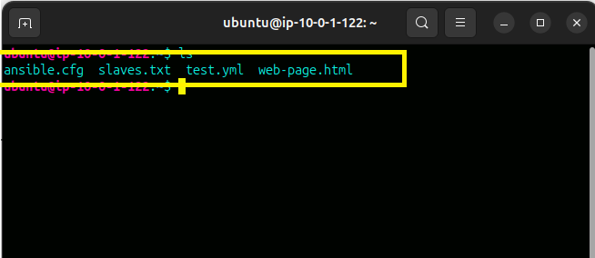
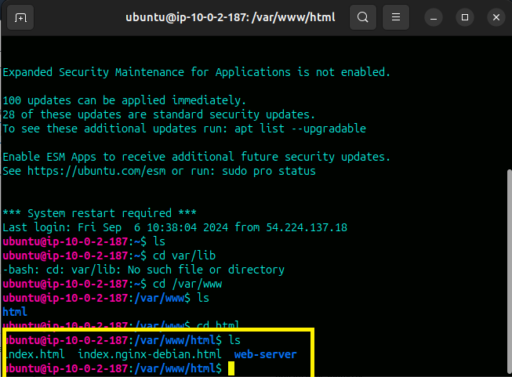
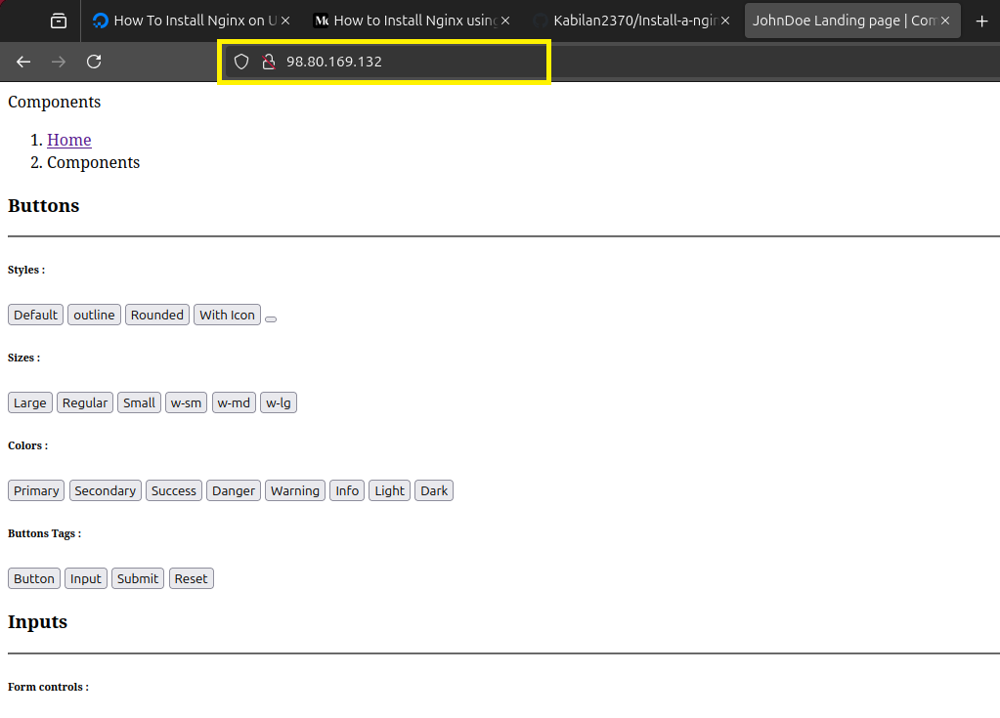

# Install-a-nginx-web-application-through-ansible-on-slave-machine.
Inatall a nginx on our slave node through ansible infra created by terraform.
Launch a customized html code on nginx default index file. Deploy a sample html on the web.

**

- These files there on Master machine..

- After install a nginx and change a customized file on nginx default file...

- Using slave machine IP access on web...

